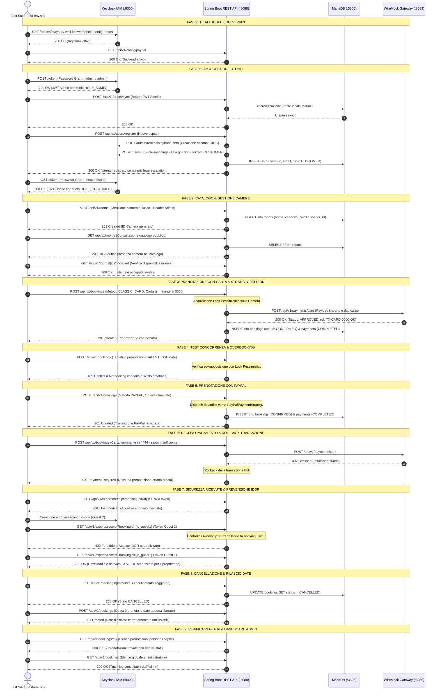

# StayHub - Flusso di Test End-to-End (E2E Test Flow)

> **Documento Tecnico:** Architettura del flusso di test d'integrazione e verifica live dei servizi.  
> **Script Associato:** [`test-env.sh`](test-env.sh) dalla root del progetto.

---

## 1. Diagramma di Sequenza del Flusso E2E

Il seguente diagramma illustra l'interazione tra tutti i componenti dell'ecosistema StayHub durante l'esecuzione automatizzata dei 29 test:



---

## 2. Dettaglio delle Fasi di Collaudo

| Fase | Descrizione | Verifica Architetturale / Requisito |
| :--- | :--- | :--- |
| **Fase 0** | Healthcheck | Disponibilità delle porte `9000` (Keycloak), `3306` (MariaDB) e `8080` (Spring Boot). |
| **Fase 1** | IAM & Registrazione | Flusso OIDC OAuth2, prevenzione privilege escalation (forzatura ruolo `CUSTOMER`). |
| **Fase 2** | Catalogo Camere | Autorizzazione RBAC con `@PreAuthorize("hasRole('ADMIN')")` e consultazione pubblica. |
| **Fase 3** | Pagamento Carta | Pattern **Strategy** ([`PaymentStrategy.java`](backend/src/main/java/com/stayhub/backend/payment/PaymentStrategy.java)) e stubbing WireMock (`TX-CARD-0000-OK`). |
| **Fase 4** | Lock Concorrenza | `@Lock(LockModeType.PESSIMISTIC_WRITE)` su [`BookingRepository.java`](backend/src/main/java/com/stayhub/backend/repository/BookingRepository.java) per evitare race condition (HTTP 409). |
| **Fase 5** | Pagamento PayPal | Simulazione checkout PayPal Sandbox con tracciamento `transactionReference`. |
| **Fase 6** | Gestione Errori Carta | Risposta HTTP `402 Payment Required` ed esecuzione del rollback `@Transactional`. |
| **Fase 7** | Sicurezza Ricevute | Eliminazione vulnerabilità IDOR: protezione con token JWT e verifica proprietà (401 / 403 / 200). |
| **Fase 8** | Ciclo di Vita Soggiorno | Transizione di stato a `CANCELLED` ed esclusione delle prenotazioni cancellate dal controllo overlap. |
| **Fase 9** | Dashboard Admin | Endpoint per metriche e log globali riservati agli amministratori. |

---

## 3. Come Lanciare i Test

Assicurati che i container e il backend siano in esecuzione:

```bash
# 1. Avvia l'infrastruttura locale
docker compose up -d

# 2. Avvia il backend Spring Boot
cd backend && ./mvnw spring-boot:run

# 3. In un altro terminale, esegui la suite:
./test-env.sh
```

Lo script è totalmente idempotente e impiega timestamp univoci per ogni ciclo, garantendo test puliti e ripetibili all'infinito.
